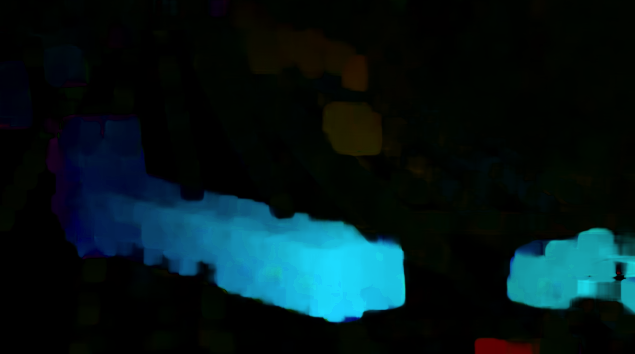

# optical-flow

	Este código tem como objetivo apontar graficamente o fluxo optico de algumas features em um vídeo.

	Para o funcionamento dos códigos apenas o OpenCV deve ser baixado utilizando o seguinte comando: ``pip3 install opencv-python``

#### Instruções para execução

1. Para executar o Fluxo Óptico Esparso: ``python3 sparse_optical_flow.py``
2. Para executar o Fluco Óptico Denso: ``python3 dense_optical_flow.py``

#### Alguns Pontos Sobre o Código
 
 O algoritmo de fluxo óptico esparso utiliza o algoritmo FAST para detectar features e o método iterativo de Lucas-Kanade com pirâmides. Após o cáculo dos pontos, é feita uma lógica para a exibição gráfica do fluxo óptico. Para podermos exibir o fluxo no vídeo deve-se clicar com o mouse sobre a janela do vídeo.

 O algoritmo de fluxo ópito denso utiliza o algoritmo de Gunnar-Farneback, onde ele calcula as diferenças de intensidade dos pixels entre dois frames, resultando numa imagem com os pixels em destaque depois de converter para HSV.

#### Saída
 
 Exemplo de reprodução do fluxo óptico esparso antes de clicar na janela:
 
 

 Exemplo de reprodução do fluxo óptico esparso após clicar na janela:
 
 

 Exemplo de reprodução do fluxo óptico denso:
 
 